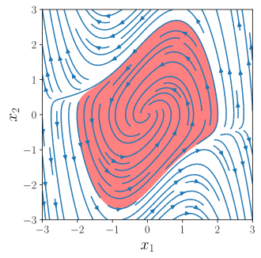
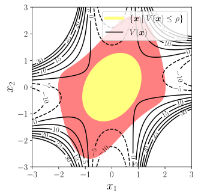

Lyapunov analysis is a method used to evaluate the stability of a dynamical system described by

$$
\dot{\bm{x}} = f(\bm{x}),
$$

where $\bm{x} \in \mathbb{R}^n$, and the system has an equilibrium point at $\bm{x} = \bm{0}$. If the equilibrium point is not located at the origin, a change of coordinates can shift it to $\bm{x} = \bm{0}$.

For a region $\mathcal{D}$ surrounding the origin, the system is considered stable in the sense of Lyapunov (i.s.L.) if a function $V: \mathbb{R}^n \to \mathbb{R}$ can be found such that:

1. $V(\bm{x}) > 0 \quad \forall \bm{x} \in \mathcal{D} \setminus \{\bm{0}\}, \quad V(\bm{0}) = 0$,
2. $\dot{V}(\bm{x}) \leq 0 \quad \forall \bm{x} \in \mathcal{D} \setminus \{\bm{0}\}, \quad \dot{V}(\bm{0}) = 0$.

In this case, $V(\bm{x})$ is known as a Lyapunov function. For more details and formal proofs, refer to [[1](#ref1), Ch 4].

## Finding Lyapunov function

When I first learned about Lyapunov functions, I was told they are notoriously difficult to find—so much so that discovering one could be worthy of publication. Surprisingly, convex optimization offers a practical method for finding Lyapunov functions. The approach involves parameterizing a set of candidate Lyapunov functions and then optimizing these parameters to search within the candidate set. The key advantage is that the optimization problem is convex in the parameter space, allowing for straightforward feasibility results. This is best demonstrated using an example.

<b>Example.</b> Consider the nonlinear system:

$$
\begin{align*}
  \dot{x}_1 &= -x_1 - 2 x_2^2 ,  \\
  \dot{x}_2 &= -x_2 - x_1 x_2 - 2 x_2^3 .
\end{align*}
$$

To certify the stability of this system, we seek a Lyapunov function $V(\bm{x})$ that is positive and ensure $\dot{V}(\bm{x})$ is negative. We parameterize $V(\bm{x})$ as

$$
V(\bm{x}) = \frac{1}{2} \bm{x}^\top \underbrace{\begin{bmatrix} p_{11} & p_{21} \\ p_{21} & p_{22} \end{bmatrix}}_{\mathbf{P}} \bm{x} ,
$$

Here, $V(\bm{x})$ is positive if $\mathbf{P} \succeq 0$. The time derivative of $V(\bm{x})$ is given by

$$
\begin{split}
  \dot{V}(\bm{x})
  &= \bm{x}^\top \mathbf{P} \dot{\bm{x}}  \\
  &= -p_{11} x_1^2 -2 p_{11} x_1 x_2^2 -p_{21} x_1^2 x_2 \\
  &\hspace{4mm} -2 p_{21} x_1 x_2^3 -2 p_{21} x_1 x_2 -2 p_{21} x_2^3 \\
  &\hspace{4mm} -p_{22} x_1 x_2^2 -2 p_{22} x_2^4 -p_{22} x_2^2 .
\end{split}
$$

To ensure $\dot{V}(\bm{x})$ is negative, we parameterize it as

$$
\dot{V}(\bm{x}) = -
  \begin{bmatrix} x_1 \\ x_2 \\ x_1x_2 \\ x_2^2 \end{bmatrix}^\top
  \underbrace{\begin{bmatrix} q_{11} &&& \text{symm} \\ q_{21} & q_{22} && \\ q_{31} & q_{32} & q_{33} & \\ q_{41} & q_{42} & q_{43} & q_{44} \end{bmatrix}}_{\mathbf{Q}}
  \begin{bmatrix} x_1 \\ x_2 \\ x_1x_2 \\ x_2^2 \end{bmatrix} .
$$

Here, $\dot{V}(\bm{x})$ is negative if $\mathbf{Q} \succeq 0$.
To find a Lyapunov function that proves stability, we solve the following convex optimization problem:

$$
\begin{align*}
  & \text{find} && p_{11}, p_{21}, p_{22}, q_{11}, \dots, q_{44}  \\
  & \text{subject to} && \mathbf{P} \succeq 0 \\
  &                   && \mathbf{Q} \succeq 0 \\
  &                   && q_{11} = p_{11} \quad q_{21} = p_{21} \quad q_{22} = p_{22} \quad q_{31} = \tfrac{1}{2} p_{21} \\
  &                   && q_{32} + q_{41} = p_{11} + \tfrac{1}{2} p_{22} \\
  &                   && q_{33} = 0 \quad q_{42} = p_{21} \quad q_{43} = 2 p_{21} \quad q_{44} = 2 p_{22} .
\end{align*}
$$

Solving this semi-definite program (SDP) yields $p_{11}=1, p_{21}=0, p_{22}=2$. The resulting Lyapunov function is

$$
V(\bm{x}) = \frac{1}{2} \bm{x}^\top \begin{bmatrix} 1 & 0 \\ 0 & 2 \end{bmatrix} \bm{x} .
$$

This technique, which involves expressing a function as a quadratic form and ensuring the associated matrix is positive semi-definite, is encapsulated as sum-of-squares (SOS) programming. Hence, we can alternatively solve the following SOS optimization problem:

$$
\begin{align*}
  & \text{find} && p_{11}, p_{21}, p_{22}  \\
  & \text{subject to} && V(\bm{x}) \text{ is SOS} \\
  &                   && -\dot{V}(\bm{x}) \text{ is SOS} .
\end{align*}
$$

Solving this SOS program also yields the same Lyapunov function.

Notice that in the example above, the system's dynamics are polynomial functions. However, rigid-body dynamics typically involve trigonometric functions. This can be mitigated by introducing new variables $s_i = \sin\theta_i$ and $c_i = \cos\theta_i$, along with the constraint $s_i^2 + c_i^2 = 1$.
The following example illustrates this approach.

<b>Example.</b> (Global stability of a pendulum)

Consider the damped pendulum shown in the figure. Its equation of motion is given by

$$
ml^2 \ddot{\theta} + b \dot{\theta} + mgl \sin\theta = 0 .
$$

We introduce a coordinate transformation from $\begin{bmatrix} \theta & \dot{\theta} \end{bmatrix}^\top$ to $\bm{z} = \begin{bmatrix} s & c & \dot{\theta} \end{bmatrix}^\top$, where $s = \sin\theta$ and $c = \cos\theta$. In this new coordinate system, the system dynamics become

$$
\dot{\bm{z}} =
\begin{bmatrix} c \dot{\theta} \\ -s \dot{\theta} \\ -\frac{g}{l} s - \frac{b}{ml^2} \dot{\theta} \end{bmatrix} .
$$

To prove the global stability of the system, we parameterize the Lyapunov function as a second-degree polynomial in $\bm{z}$:

$$
V(\bm{z}) = \alpha_0 + \alpha_1 s + \alpha_2 c + \alpha_3 \dot{\theta} + \alpha_4 s^2 + \dots + \alpha_9 \dot{\theta}^2 .
$$

Its time derivative is given by

$$
\dot{V}(\bm{z}) = \frac{\partial V(\bm{z})}{\partial \bm{z}} \dot{\bm{z}} .
$$

To determine $V(\bm{z})$, we solve the following SOS optimization problem:

$$
\begin{align*}
  & \text{find} && \alpha_0, \dots, \alpha_9, \lambda_0, \dots, \lambda_9  \\
  & \text{subject to} && V(\bm{z})  \text{ is SOS}  \\
  &                   && -\dot{V}(\bm{z}) + \lambda(\bm{z}) (s^2+c^2-1) \text{ is SOS}  \\
  &                   && V(\begin{bmatrix} 0 & 1 & 0 \end{bmatrix}^\top) = 0 ,
\end{align*}
$$

where $\lambda(\bm{z})$ is a second-degree polynomial of the form:

$$
\lambda(\bm{z}) = \lambda_0 + \lambda_1 s + \dots + \lambda_9 \dot{\theta}^2 .
$$

The constraint

$$
-\dot{V}(\bm{z}) + \lambda(\bm{z}) (s^2 + c^2 - 1) \text{ is SOS}
$$

ensures that

$$
-\dot{V}(\bm{z}) \geq -\lambda(\bm{z}) (s^2 + c^2 - 1) ,
$$

which implies $-\dot{V}(\bm{z}) \geq 0$ whenever $s^2 + c^2 = 1$.

Solving the SOS program for $m=1$, $l=1$, $g=9.81$, and $b=0$ gives the Lyapunov function:

$$
\begin{split}
V &= 0.5 \dot{\theta}^{2} + 4.905 s^2 + 4.905 (1 - c)^2  \\
  &= 0.5 \dot{\theta}^{2} + 9.81 (1 - c) .
\end{split}
$$

This turns out to be the total energy of the system.

## Finding the region of attraction

Sometimes, global stability is too much to ask for. For example, when balancing a robot using a controller, a disturbance that deviates the robot from its equilibrium configuration too much can still cause it to fall. Therefore, we aim to identify the largest region in which the system remains Lyapunov stable.

For a given dynamical system

$$
\dot{\bm{x}} = f(\bm{x}),
$$

where $f$ is continuous. If there exists a scalar function $V(\bm{x})$ such that

$$
V(\bm{x}) > 0 \quad \forall \bm{x} \neq \bm{0}, \quad V(\bm{0}) = 0,
$$

then a bounded sublevel set

$$
\mathcal{G} = \bigl\{ \bm{x} \mid V(\bm{x}) \leq \rho \bigr\}
$$

defines a region of attraction (ROA), provided that

$$
\dot{V}(\bm{x}) \leq 0 \quad \forall \bm{x} \in \mathcal{G}.
$$

### Known Lyapunov function

In this section, we assume that the Lyapunov function is known exactly. This assumption is not overly restrictive, as several methods provide explicit Lyapunov functions. For example, in a closed-loop system with an LQR controller, the cost-to-go function serves as a Lyapunov function. Alternatively, we can linearize a system at its equilibrium point, yielding the linearized system matrix $\mathbf{A}$. The solution $\mathbf{P}$ to the Lyapunov equation

$$
\mathbf{A}^\top \mathbf{P} + \mathbf{P} \mathbf{A} = -\mathbf{Q}
$$

where $\mathbf{Q} \succ 0$, provides a quadratic Lyapunov function of the form

$$
V(\bm{x}) = \bm{x}^\top \mathbf{P} \bm{x}.
$$

Nonetheless, we will later relax this requirement.

**Formulation 1**

To determine the ROA, we can formulate the following optimization problem:

$$
\begin{align*}
  & \text{maximize}   && \rho  \\
  & \text{subject to} && -\dot{V}(\bm{x}) + \lambda(\bm{x}) (V(\bm{x}) - \rho) \text{ is SOS}  \\
  &                   && \lambda(\bm{x}) \text{ is SOS}.
\end{align*}
$$

In this formulation, $V(\bm{x})$ and $\dot{V}(\bm{x})$ are known and fixed, while the decision variables are $\rho$ and the coefficients of the polynomial $\lambda(\bm{x})$. The first SOS constraint ensures that

$$
\dot{V}(\bm{x}) \leq \lambda(\bm{x}) (V(\bm{x}) - \rho) ,
$$

which implies $\dot{V}(\bm{x}) \leq 0$ for all $\bm{x}$ satisfying $V(\bm{x}) \leq \rho$. However, this optimization problem is not convex, as it involves bilinear terms in the decision variables.

**Formulation 2**

An alternative formulation of the optimization problem is

$$
\begin{align*}
  & \text{maximize}   && \rho  \\
  & \text{subject to} && (\bm{x}^\top \bm{x})^d (V(\bm{x}) - \rho) - \lambda(\bm{x}) \dot{V}(\bm{x}) \text{ is SOS}  \\
  &                   && \lambda(\bm{x}) \text{ is SOS} ,
\end{align*}
$$

where $d$ is a fixed positive integer.
The first SOS constraint ensures that

$$
\lambda(\bm{x}) \dot{V}(\bm{x}) \leq (\bm{x}^\top \bm{x})^d (V(\bm{x}) - \rho) ,
$$

which implies $\dot{V}(\bm{x}) \leq 0$ for all $\bm{x}$ satisfying $V(\bm{x}) \leq \rho$.
Unlike the previous formulation, this optimization problem is convex and can be solved efficiently to determine the ROA, given by $\{ \bm{x} \mid V(\bm{x}) \leq \rho \}$.

**Formulation 3**

We claim that the SOS constraint on $\lambda(\bm{x})$ is unnecessary, leading to the simplified optimization problem:

$$
\begin{align*}
  & \text{maximize}   && \rho  \\
  & \text{subject to} && (\bm{x}^\top \bm{x})^d (V(\bm{x}) - \rho) + \lambda(\bm{x}) \dot{V}(\bm{x}) \text{ is SOS} .
\end{align*}
$$

Why is this possible? First, note that $\dot{V}(\bm{x}) < 0$ in the vicinity of the origin, except at the origin itself.
Additionally, observe that whenever $\dot{V}(\bm{x}) = 0$, we have $V(\bm{x}) - \rho \geq 0$. Since $\dot{V}(\bm{x})$ is continuous, it follows that $\dot{V}(\bm{x}) < 0$ for all $\bm{x}$ satisfying $V(\bm{x}) - \rho < 0$, except at the origin.

The following example shows how this formulation can be used to find the ROA.

<b>Example.</b> (Time-reversed van der Pol oscillator)

The time-reversed van der Pol oscillator is governed by

$$
\begin{align*}
  \dot{x}_1 &= -x_2 ,  \\
  \dot{x}_2 &= x_1 + (x_1^2 - 1) x_2 .
\end{align*}
$$

The phase portrait of the system is shown in the figure below.

The system has an equilibrium at the origin and a ROA highlighted in red. Near the origin, the linearized system is

$$
\begin{bmatrix} \dot{x}_1 \\ \dot{x}_2 \end{bmatrix} =
\underbrace{\begin{bmatrix} 0 & -1 \\ 1 & -1 \end{bmatrix}}_{\mathbf{A}}
\begin{bmatrix} x_1 \\ x_2 \end{bmatrix} .
$$

Solving the Lyapunov equation $\mathbf{A}^\top \mathbf{P} + \mathbf{P} \mathbf{A} = -\mathbf{I}$ gives us a Lyapunov function $V(\bm{x}) = \bm{x}^\top \mathbf{P} \bm{x}$.

Solving the SOS optimization problem

$$
\begin{align*}
  & \text{maximize}   && \rho  \\
  & \text{subject to} && (\bm{x}^\top \bm{x})^d (V(\bm{x}) - \rho) + \lambda(\bm{x}) \dot{V}(\bm{x}) \text{ is SOS} ,
\end{align*}
$$

gives the ROA: $\{ \bm{x} \mid V(\bm{x}) \leq \rho \}$.

 

The solved ROA (highlighted in green) is a subset of the true ROA (highlighted in red).

### Searching for both Lyapunov function and ROA

## References

<ol class="reference">
  <li>
    H. K. Khalil, <em>Nonlinear Systems</em>, 3 ed. Pearson, 2001.
  </li>
  <li>
    Russ Tedrake. <a href="https://underactuated.csail.mit.edu" target="_blank"><em>Underactuated Robotics: Algorithms for Walking, Running, Swimming, Flying, and Manipulation</em></a>, 2025.
  </li>
</ol>